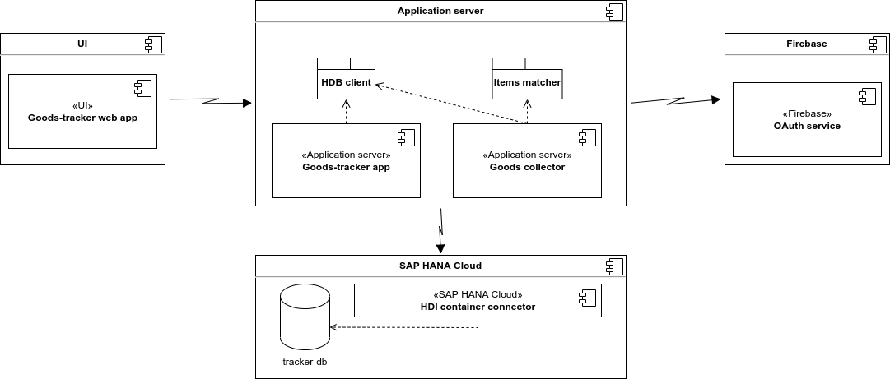

# Khrystsenka. 953504. Products agregation.
Track your favourite goods in different belarusian shops.

# Техническое задание для Goods-tracker app
## Введение
### Цели
Цель этого документа представить детальное описание состава и функциональности онлайн сервиса для отслеживания информации о (продовольственных) товарах, доступных в популярных розничных магазинах.

### Соглашения о терминах
|  Термин | Определение |
| ------------- | ------------- |
| Трекер  | Здесь и далее используется как синоним для названия проекта, агрегатора, приложения, сервиса и продукта в целом.  |
| Предмет | Единичный товар отдельного магазина, просто считанный с сайта магазина.  |
| Товар | Совокупность обработанных сервисом товаров из разных магазинов. В идеале связывает предметы из разных магазинов, которые олицетворяют один товар.  | 
| Участник | Зарегестрированный пользователь.  |
| Пользователь | Любой человек использующий сервис посредством интерфейса пользователя. |

### Предполагаемая аудитория
Данный документ предназначен в первую очередь для разработчиков и потенциальных участников проекта, которые захотят внести свою лепту.

### Масштаб проекта
Трекер должен представлять собой простой каждодневный инструмент для рядовых пользователей, которые желают подходить к покупкам более расчетливо. Приложение создано для автоматизации поиска различных товаров в популярных белорусских розничных магазинах, с целью нахождения наиболее выгодных предложений. Посредством разработанных инструментов, пользователь сможет находить подходящие ему предложения, а также экономить деньги и, возможно, время.

Говоря конкретнее, сервис представляет собой регулярно обновляемую базу данных товаров (предметов), доступную посредством онлайн сервиса. Сервис работает по принципу web-приложения, доступного из любого браузера, предоставляющего функционал по поиску, отслеживанию и сравнению товаров.

### Ссылки на источники
Здесь хранятся ссылки на источники, информация из которых активно используется при разработке продукта.
## Общее описание
### Видение продукта
Трекер является своего рода каталогом продовольственных товаров, который автоматически обновляется с определенной периодичностью (например неделя), выдавая только самую актуальную информацию. Более того, помимо обычного считывания информации с разных площадок, он посредством обученной модели постоянно соотносит предметы и связывает их воедино, для более удобного поиска и аналитики цен.

Высокоуровневая диаграмма продукта представлена на фигуре 1.

**Фигура 1. Высокоуровневое взаиморасположение компонентов проекта** 
### Классы и характеристики пользователей
| Компонент | Описание |
| ------------- | ------------- |
| User | Пользователь (участник) web-приложения, который потребляет сервис посредством браузера. |
| User interface | Совокупность инструментов, поставляемых сервисом в виде web форм. Среди них строка поиска по товарам, анализ цен собранной корзины и планирование заказа. |
| Server-side logic | Компонент отражает серверную часть приложения и отвечает за обработку пользовательских запросов при использовании приложения. |
| Goods collector | Настраиваемый движок для считывания предметов с разных площадок. |
| Scapers lib | Набор классов для сбора данных о предметах с площадок. |
| Items matcher | Модуль, отвечающий за сопоставление товаров из различных магазинов на основе обученной модели. |
| Configs | Конфигурации для сборщиков данных соответствующих магазинов. |
| Relational DB | Реляционная база данных, которая хранит информацию о магазинах, предметах и товарах, а также организовывает их чтение. |
| OAuth service| Облачный сервис, который берет на себя обработку пользовательской авторизации и аутентификации и хранит информацию о них.  |
### Функциональность продукта
Среди основных функций продукта будут поиск товаров по названию и описанию, отслеживание товаров зарегестрированными участниками, сборка корзины и анализ ее стоимости на разных площадках, возможность заказа корзины (или ее части) на определенной площадке или поиск ближайшего магазина с актуальным товаром.

Следует отметить, что помимо предоставления пользовательских функций, сервис решает задачу связывания предметов с разных площадок, посредством обученной модели.
### Среда функционирования продукта (операционная система)
- СФ-1: сервис должен корректно функционировать в следующих браузерах: Firefox версии 86 и выше, Google Chrome (все версии), Opera (после 2015г).
- СФ-2: контейнер с серверной частью должен разворачиваться и работать в системах с основой на Linux.
- СФ-3: сборщик данных также контейнеризирован с возможностью развертывания и запуска на сервере посредстом Job scheduler'a с определенным графиком. 
- СФ-4: база данных также должна разворачиваться в виде контейнера или облачного сервиса.
- СФ-5: сервис OAuth расположен в облаке, на основе Firebase
### Рамки, ограничения, правила и стандарты
- О-1: К качестве необходимого минимума агрегируемых площадок выделим следующие: [Соседи](https://sosedi.by/), [Евроопт](https://e-dostavka.by/catalog/), [Green](https://green-dostavka.by/).
### Документация для пользователей
 - [Clean code for .NET](https://github.com/thangchung/clean-code-dotnet)
### Допущения и зависимости
- Д-1: пренебрежение некоторыми постулатами при разработки интерфейса пользователя в силу ограниченности по времени и большим требованиям к функциональности и работе сервера, на которой строится пользовательский опыт. Говоря иначе, на UI будет выделено меньше всего времени, но минимум в виде рабочей функциональности и стабильности должен быть соблюден.
- Д-2: Так как адаптаптация интерфейса для мобильных устройств требует дополнительных ресурсов и отдельного подхода, допускается пренебречь этим на данном этапе.
- Д-3: В силу того, что задача связывания объектов (matching'a) в индустрии на данный момент не решена качественно, а времени и экспертизы на ковку своей модели не имеется, то допускается, что обученная модель может иметь относительно высокую вероятность ошибки. На стадии проектирования указать допустимую вероятность трудно.
## Функциональность системы
Данный параграф описывает варианты использования (use cases) функциональности продукта, как пользователи могут взаимодействовать с проектом.
### UC-1. Поиск товаров (предетов)
#### Описание и приоритет
Пользователь (не обязательно зарегестрированный) заходит в web-приложение через браузер, через Меню выбирает нужную секцию и получает доступ к поисковой строке по товарам (предметам).
#### Пошаговое описание
1. Пользователь запускает приложение.
2. На отображенном интерфейсе на панели "Меню" пользователь выбирает секцию "Поиск" обзора товаров (предметов).
3. После перенаправления на новую страницу на интерфейсе отображается поисковая строка, фильтры и лист, заполняемый объектами поиска. Каждый элемент листа содержит информацию об определенном объекте (название, цена, скидка, когда в последний раз был обновлен, возможное изображение).
4. Далее пользователь может:
    * Пролистывать выведенный лист и переключаться между страницами вывода, посредством панели (pagination).
    * Воспользоваться поиском, введя строку и нажать на "лупу". Далее как в предыдущем пункте данного шага.
    * Настраивать фильтры поиска (дата обновления товара, цена, скидка), затем как в предыдущем пункте данного шага.
    * Переходить на страницу товара (предмета) для получения более детальной информации, после нажатия на очередной товар(предмет).
    * Добавлять/удалять товар (предмет) в корзину(ы), используя кнопки "Добавить"/"Удалить". Также должна быть возможность управлять количеством добавляемых товаров.
### UC-2. Просмотр страницы товара.
#### Описание и приоритет
Каждый товар(предмет) должен иметь свою страницу с более детальной информацией, которую может просматривать пользователь.
#### Пошаговое описание
1. Пользователь нажимает на плитку товара(предмета), например в листе с результатами поиска на поисковой странице.
2. Открывается страница, где отображено изображение товара (предмета), его цена, скидка, график цен (если обновлялся ранее), магазин(ы), к которому(ым) он пренадлежит, описание.
3. Далее пользователь может:
    * С помощью кнопок "Добавить"/"Удалить" добавить или удалить товар (предмет) соотвественно, отредактировав тем самым корзину. Также должна быть возможность управлять количеством добавляемых товаров.
    * Вернуться назад.
### UC-3. Составление корзины и ее анализ
#### Описание и приоритет
Просмотр и изменения корзины представляет собой отдельный инструмент, где пользователь может дополнительно находить товары (предметы), добавлять(удалять) их в корзину и видеть информацию о том, собранные предметы (или их часть) стоят на той или иной площадке.
#### Пошаговое описание
1. Пользователь запускает приложение.
2. На отображенном интерфейсе на панели "Меню" пользователь выбирает секцию корзины.
3. После перехода на следующую страницу на интерфейсе слева отображется строка поиска товаров (предметов) для их добавления "на месте". По середине набор уже добавленных объектов (если они были добавлены ранее). И справа информация о корзине (общая сумма, сумма по магазинам и т.д.), которая динамически изменяется в соответствии с модификациями в корзине.
4. Пользователь может:
    * Посредстом упрощенной строки поиска находить больше объектов, которые будут выводится в виде ленты слева. Должна быть возможность добавить товар в основной набор посредством кнопки "Добавить" на плитке товара. Также должна быть возможность управлять количеством добавляемых товаров.
    * Удалить товар (предмет) из основного набора, тем самым манипулируя общей информацией о корзине на панели справа.
    * На панели справа должна отображаться общая сумма покупки товаров из основного набора, со скидками и без. Также должна выводиться стоимость по отдельным магазинам, исходя из того есть ли в этом множестве товары (предметы) принадлежащие определенной площадке.
    * Кнопка "Построить маршурт", которая позволяет построить путь за покупками (при нажатии переход к UC-4).
    * Кнопка "Заказать в магазине" должна находится рядом с соответствующим показателем суммы по магазину, который поддерживает доставку (при нажатии переход к UC-5)

### UC-4. Построение маршрута покупок
#### Описание и приоритет
После составления удовлетворительной корзины, пользователь должен иметь возможность проложить маршрут, по которому он будет покупать собранную корзину, если его это удовлетворяет. Иходя из собранной корзины, система должна понимать в магазинах следует купить отдельные товары и проложить кольцевой маршрут, по которому пользователь сможет обойти каждый магазин наиболее быстрым путем и вернутся в изначальную точку.

Данная функциональность имеет низкий приоритет
#### Пошаговое описание
1. После нажатия на кнопку "Построить маршрут" на странице с составлением с корзиной, открывается форма с интегрированным виджетом Яндекс.Карты, который просит ввести текущую локацию.
2. Пользователь вводит свой адрес и виджет показывает цикличный маршрут между его локацией и ближайшими точками определенных магазинов, где можно купить выбранные объекты (или их часть).
3. Далее возможен экспорт построенного пути в соц. сети или приложения.

### UC-5. Заказ в магазине.
#### Описание и приоритет
Функция должна обеспечивать возможность заказывать товары (предметы) набранные в корзине (или их часть) в определенном магазине, если он предоставляет услугу доставки на дом.

Данная функциональность имеет низкий приоритет.
#### Пошаговое описание
1. После нажатия на кнопку "Заказать в магазине" на странице управления карзиной (UC-3) пользователь должен быть перенаправлен на страницу магазина, чтобы перейти к оформления заказа. В идеале корзина магазина должна заполняться автоматически в соотвествии с выбранным набором объектов.
### UC-6. Регистрация и вход.
#### Описание и приоритет
Если пользователь хочет получить дополнительную функциональность в виде рассылки, добавления товара (предмета) в "Любимые", оповещении о появлении скидок на "Любимые" товары (предметы), то ему необходимо зарегестрироваться (войти) и стать участником. 
#### Пошаговое описание
1. Пользователь запускает приложение. В секции "Меню" нажимает на кнопку "Вход/Регистрация".
2. После перехода на следующую страницу, появляется форма для входа и регистрации.
3. Пользователь может:
    * Выбрать опцию регистрации, после чего откроется форма для ввода имени, почты и пароля. В случае невалидного адреса, уже существующего адреса, недопустимых символов в пароле или при несоотвествии двух паролей должно выводиться соответсвтующее сообщение в виде всплываюшего окна.
    * Выбрать опцию входа, после чего откроется форма для ввода почты и пароля. В случае ошибки авторизации сервисов, должно выводится соответствующее сообщения в виде всплывающего окна.
4. В случае успеха входа или регистрации пользователь перенаправляется на главную страницу.
### UC-7. Добавление (удаление) в (из) "Любимые".
#### Описание и приоритет
Иногда участнику важны какие-то определенные товары (предметы), динамика и отслеживание их цен. Эта информация может быть полезна для последующей рассылки участникам сообщения о новых выгодных предложених с их любимыми товарами (предметами). Для этого у пользователя должна быть возможность добавления объектов в список "Любимых".
#### Пошаговое описание
1. Участник совершил поиск на поисковой странице или на странице управления корзиной, в результате чего появился список объектов в виде листа.
2. Каждый элемент листа имеет кнопку "Добавить в любимые" (при условии что участник вошел в систему), при нажатии на которую, объект добавляется в список "Любимые" и появляется на странице "Любимые".
3. Если участник хочет убрать объект из "Любимых", он может нажать на эту кнопку повторно. Объект должен перестать отображаться на странице "Любимые".
### UC-8. Просмотр списка "Любимые".
#### Описание и приоритет
Участнику необходим инструмент для управления списком с наиболее интересными ему объектами. Для этого должна существовать отдельная страница с возможностью просмотра добавленных в "Любимые".
#### Пошаговое описание
1. Пользователь в секции "Меню" нажимает на кнопку "Любимые".
2. После перехода на страницу, перед ним отображается список:
    * Если пользователь авторизован, то список заполняется добавленными ранее объектами. В данном случае также возможна навигация на страницу с более детальной информацией об объекте, а также удаление объектов из "Любимых" посредстом нажатия кнопки "Удалить" на соотвествующем объекте, после чего он должен пропасть.
    * Если пользователь авторизован, но добавленных объектов еще нет, то отображается соответствующее сообщение и предложение перейти к поиску.
    * Если пользователь неавторизован, то должно отображаться сообщение с предложением войти или зарегестрироваться, чтобы получить доступ к списку.
## Требования к внешним интерфейсам
### Интерфейсы пользователя
- ИП-1: Каждая страница должна сопровождаться коротким комментарием и руководством о том, как использовать ее.
- ИП-2: Объекты, которые были обновлены более недели назад, должны помечатся соответствующим флагом, оповещающий пользователей, что информация может быть неактуальна на данный момент.
### Программные интерфейсы
- ПИ-1: Web-приложение трекера
    * ПИ-1.1: Приложение в браузере (User Interface) взаимодействует с сервером (Server-side logic) посредством выстроенного REST API для обмена данными.
- ПИ-2: Серверная логика
    * ПИ-2.1: Сервер (Server-side logic) взаимодействует с БД (Relative DB) посредством авторизированного SQL соединения.
    * ПИ-2.2: Сервер (Server-side logic) взаимодействует с OAuth сервисом посредством SSL сертификата, заранее выданного сервисом.
- ПИ-3: Сборщик данных (Data collector)
    * ПИ-3.1: Сборщик (Data collector) взаимодействует с БД (Relative DB) посредством авторизированного SQL соединения.
    * ПИ-3.2: Добавление новой тарговой площадки к сборщику данных не должно требовать никаких модификаций уже написанном движке сборщика, реализация должна происходить только из позиции последующего расширения (например реализации интерфейса и включения его в пулл обработчика).
- ПИ-4:
    * ПИ-4.1: БД (Relative) должно поставлять отдельные отображения (SQL View) для каждой задаче, выдвигаемой к БД (например чтение товаров, чтение списка "Любимые" определенного пользователя). Прямых обращений к таблицам быть не должно. 
<!-- ## Нефункциональные требования
### Требования к производительности
### Требования к сохранности (данных)
### Критерии качества программного обеспечения
### Требования к безопасности системы -->
